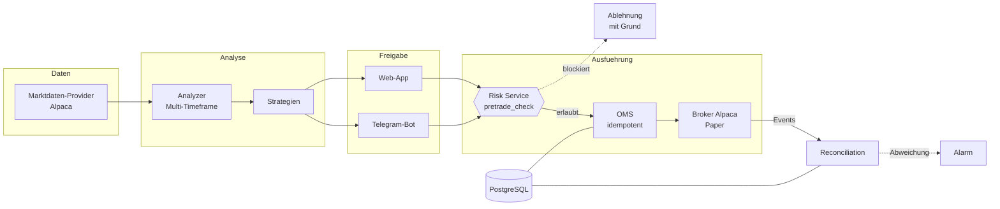

# stockbot — Trading Research & Execution Assistant

Ein Handelsassistent für US-Aktien mit zwei Bedienoberflächen (Telegram-Bot und Web-App), der
Signale aus technischer Analyse erzeugt, sie durch eine mehrstufige Risikoprüfung schickt und
nach ausdrücklicher Freigabe durch den Nutzer als Order an den Broker (Alpaca) weitergibt.

**Der Handel läuft im Paper-Modus. Live-Handel ist im Code hart gesperrt** und lässt sich nur
über eine explizite Freigabe samt Konfigurationsschalter aktivieren — bis dahin verweigert der
Start jede Konfiguration, die echtes Geld bewegen würde.

```
Python 3.11+ · 25.000 Zeilen Produktionscode · 1.525 Tests · PostgreSQL (SQLite als Rückfall)
```

---

## Was daran technisch interessant ist

Der Reiz des Projekts liegt nicht in der Signalberechnung — Indikatoren sind Handwerk. Er liegt
darin, dass ein Fehler hier Geld kostet. Die vier Stellen, an denen sich das im Code
niederschlägt:

**Keine Order kann die Risikoprüfung umgehen — und das ist nicht nur behauptet.**
Sämtliche Order-Ausführung läuft durch ein zentrales Order-Management-System
([`stockbot/execution/oms.py`](stockbot/execution/oms.py)); Telegram und Web rufen beide
dieselbe Stelle auf. [`tests/test_no_order_bypasses_risk.py`](tests/test_no_order_bypasses_risk.py)
prüft das **strukturell**: Der Test scannt die Bedienschichten und schlägt fehl, sobald dort ein
direkter Broker-Aufruf auftaucht. Ein neuer Codepfad, der die Prüfung umgeht, macht die Suite
rot — nicht die Produktion kaputt.

**Doppelte Ausführung ist ausgeschlossen.**
Jede Handelsabsicht trägt einen Idempotenzschlüssel; ein zweiter Klick auf „Kaufen" erzeugt
keine zweite Order, sondern findet die erste wieder
([`tests/test_double_submit_idempotency.py`](tests/test_double_submit_idempotency.py)).
Ergänzt um eine Zustandsmaschine, die Rückschritte (`filled` → `partially_filled`) laut ablehnt,
statt sie still zu übernehmen.

**Die eigene Sicht wird laufend gegen die des Brokers abgeglichen.**
Ein Reconciliation-Job vergleicht periodisch die Positionen in der Datenbank mit denen beim
Broker und meldet Abweichungen, statt sie auszusitzen
([`stockbot/execution/reconcile_scheduler.py`](stockbot/execution/reconcile_scheduler.py)).
Dazu ein persistenter Kill-Switch, der neue Positionen sperrt, Schutz-Verkäufe aber weiter
zulässt — und der einen Prozessneustart überlebt, weil er in der Datenbank steht.

**Der Backtest darf nicht lügen.**
Walk-Forward-Aufteilung mit Embargo gegen Label-Leakage, gap-realistische Ausstiege (eine
Kurslücke über den Stop hinweg füllt zum Eröffnungskurs, nicht am Wunschpreis), Spread- und
Slippage-Kosten in den Voreinstellungen, und ein sichtbarer Warnhinweis im Bericht, wenn das
Universum mangels historischer Zusammensetzung auf die heutige Liste zurückfällt
([`stockbot/backtest/`](stockbot/backtest/)).

---

## Architektur



Daneben laufen drei Nebenpfade, die den Handelsweg nie berühren: die **Backtest-Engine**, ein
**Strategie-Labor**, das Parameter optimiert und Kandidaten nur mit menschlicher Freigabe
befördert, und ein **Shadow-Modus**, der Signale mitschreibt, ohne sie auszuführen.

---

## Wo man am besten anfängt zu lesen

Je nachdem, was dich interessiert:

| Interesse | Datei |
|---|---|
| Wie eine Order entsteht und was sie aufhalten kann | [`stockbot/execution/oms.py`](stockbot/execution/oms.py) |
| Die Risikoprüfungen selbst (Reihenfolge, Ablehngründe) | [`stockbot/core/risk.py`](stockbot/core/risk.py) |
| Wie aus Kursen ein Signal wird | [`stockbot/market/analyzer.py`](stockbot/market/analyzer.py) |
| Backtest ohne Look-ahead | [`stockbot/backtest/engine.py`](stockbot/backtest/engine.py) |
| Datenbankzugriff über einen Seam (Postgres **und** SQLite) | [`stockbot/core/db.py`](stockbot/core/db.py) |
| Der Test, der Architektur erzwingt statt sie zu dokumentieren | [`tests/test_no_order_bypasses_risk.py`](tests/test_no_order_bypasses_risk.py) |

Wer lieber am Verhalten einsteigt: [`tests/test_failure_injection.py`](tests/test_failure_injection.py)
zeigt, was das System tut, wenn der Feed ausfällt, der Broker nicht antwortet oder die Kursdaten
veraltet sind.

---

## Setup

### 1. Telegram-Bot anlegen

In Telegram `@BotFather` öffnen, `/newbot` senden, Namen vergeben, Token kopieren.

### 2. Installation

```bash
pip install -e .
pip install -r requirements-dev.txt   # für die Tests
```

### 3. Konfiguration

`.env.example` nach `.env` kopieren und eintragen:

```env
TELEGRAM_TOKEN_ENV=dein_token_hier
ENCRYPTION_KEY=generierter_schluessel
```

Der `ENCRYPTION_KEY` verschlüsselt die hinterlegten Broker-Zugangsdaten in der Datenbank.
Einmalig erzeugen:

```bash
python -c "from cryptography.fernet import Fernet; print(Fernet.generate_key().decode())"
```

### 4. Starten

```bash
python run_bot.py
```

Die Web-App läuft im selben Prozess mit (Port 8000); ein zweiter Dienst ist nicht nötig.

### 5. Registrieren

Der Bot ist mehrbenutzerfähig — jede Person registriert sich selbst. Eigenen Chat öffnen,
`/start` senden, dem Dialog folgen: Trade-Größe festlegen, optional einen Broker-Zugang
verbinden (die Zugangsdaten werden verschlüsselt gespeichert und die Nachricht danach gelöscht).

### 6. Tests

```bash
pytest                          # alle Suiten, ohne Netz und ohne Telegram
pytest tests/test_risk.py       # einzelne Datei
```

Die Contract-Tests gegen PostgreSQL überspringen sich sauber, wenn keine Datenbank erreichbar
ist — ein Skip ist dort kein bestandener Test, sondern ein ausgelassener.

---

## Bedienung

### Telegram

Signalkarten mit Begründung und Freigabeknöpfen, Positionsübersicht, Kill-Switch
(`/killswitch`), Dashboard-Link. Jede Nachricht, die zu einer Handelsentscheidung auffordert,
trägt ihren Betriebsmodus in der ersten Zeile:

```
PAPER

NVDA — LONG
Kurs: $875.40
Signal-Stärke: 4/5
  • RSI 32.1 — überverkauft
  • MACD: bullishe Überkreuzung
  • Trend (MA50/200): aufwärts
  • Volumen: 1,8x Durchschnitt
Take-Profit: $891.20  ·  Stop-Loss: $861.30
```

### Web-App

Läuft parallel und teilt sich Konto und Datenbank mit dem Bot — eine Aktion wirkt sofort in
beiden Kanälen, weil beide dieselbe Service-Schicht aufrufen.

- **Anmeldung** über Telegram-Login oder einen privaten Token-Link
- **`/app`** — Signale prüfen und freigeben (mit Pflicht-Bestätigungsdialog in fester
  Feldreihenfolge), offene Positionen schließen
- **`/app/settings`** — Strategien, Stop-/Take-Profit-Modus, Benachrichtigungen, Kill-Switch
- **`/app/dashboard`** — Kennzahlen und Charts, Paper- und Shadow-Modus getrennt ausgewiesen
- **`/app/backtest`**, **`/app/lab`**, **`/app/reports`**, **`/app/watchlist`**

Sicherheit: Session-Cookies (httponly, `secure` unter HTTPS), Content-Security-Policy, HSTS,
CSRF-Schutz über Origin-Abgleich, Rate-Limit auf den Login-Endpunkten. Für öffentlichen Betrieb
hinter TLS stellen — siehe [`deploy/Caddyfile`](deploy/Caddyfile).

### Demodaten für die Oberflächenarbeit

Ein frisches Checkout hat eine leere Datenbank; ohne Daten zeigt die App nur den Login.
[`tools/seed_design_data.py`](tools/seed_design_data.py) füllt eine **eigene** SQLite-Datei
(`data/design_seed.db`, niemals die Betriebsdatenbank) mit einem breiten Zustandsraum: offene
Positionen in Gewinn und Verlust, abgelehnte Signale mit echten Ablehngründen, Layout-Randfälle,
aktiver Kill-Switch.

```bash
ENCRYPTION_KEY=<Fernet-Key> python tools/seed_design_data.py
```

Idempotent, und bricht ab, wenn es versehentlich gegen PostgreSQL oder die Betriebsdatenbank
laufen würde.

---

## Analyse-Grundlage

| Indikator | Bedeutung |
|-----------|-----------|
| RSI | Über-/Unterkauft-Niveau |
| MACD | Momentum und Trendwechsel |
| MA50 / MA200 | kurz- und langfristiger Trend |
| Wochentrend | übergeordneter Filter gegen Abwärtsphasen |
| Volumen | Bestätigung durch Handelsinteresse |
| Support / Widerstand | wie oft ein Niveau getestet wurde |
| Smart Money | Netto-Käufe von Insidern (Form 4) und Institutionen (13F) |

Die Gewichtung ist je Anlageklasse unterschiedlich
([`stockbot/market/asset_classes.py`](stockbot/market/asset_classes.py)). Produktiv freigegeben
sind drei Strategien; weitere laufen nur im Research-Modus.

---

## Betrieb

Produktiv läuft der Dienst auf PostgreSQL (der SQLite-Pfad bleibt als Rückfall bestehen; beide
liegen hinter demselben Zugriffs-Seam und müssen identische Ergebnisse liefern). Schemaänderungen
laufen über Alembic — der Wechsel des Backends wurde im laufenden Betrieb über zehn Migrationen
vollzogen.

Einrichtung auf einem frischen Ubuntu-Server:

```bash
git clone <repo> /root/stockbot && cd /root/stockbot
bash deploy/setup_server.sh     # venv, Abhängigkeiten, .env, systemd-Dienst
nano .env                       # TELEGRAM_TOKEN_ENV eintragen
systemctl restart stockbot
```

Weiteres: [`docs/RUNBOOK.md`](docs/RUNBOOK.md) (Störungsfall, Eskalation, Kill-Switch),
[`docs/BACKUP_RESTORE.md`](docs/BACKUP_RESTORE.md) (verschlüsselte Backups, verifizierter
Restore), [`docs/DEPLOY_HARDENING.md`](docs/DEPLOY_HARDENING.md).

---

## Projektdokumentation

| Dokument | Inhalt |
|---|---|
| [`docs/UMSETZUNGSPLAN.md`](docs/UMSETZUNGSPLAN.md) | Fahrplan, Stand und Befunde |
| [`docs/GO_NO_GO.md`](docs/GO_NO_GO.md) | Freigabekriterien für den Paper-Betrieb |
| [`docs/Stylekonzept.md`](docs/Stylekonzept.md) | Gestaltungsprinzipien der Oberflächen |
| [`DESIGN.md`](DESIGN.md) | umgesetztes Designsystem, Tokens, Kontrastwerte |
| [`PRODUCT.md`](PRODUCT.md) | Produktsicht und Zielgruppe |

---

## Stand und Grenzen

Ehrlich zum Reifegrad:

- **Paper-Handel**, Live ist gesperrt und an eine dokumentierte Freigabe gebunden.
- Einzelne Schutzmechanismen sind bewusst hinter Schaltern abgelegt und **standardmäßig aus** —
  sie ändern das Handelsverhalten und werden erst nach einer bewussten Entscheidung aktiviert.
  Welche das sind, steht im Umsetzungsplan.
- Der Code enthält Bausteine, die gebaut, aber noch nicht angebunden sind. Sie sind als solche
  gekennzeichnet, statt Vollständigkeit vorzutäuschen — im Umsetzungsplan gibt es dafür eine
  eigene Befundliste samt der Methode, mit der sie gefunden wurden.
- Kommentare und Commit-Nachrichten sind deutsch.

**Dies ist kein Anlageprodukt und keine Anlageberatung.** Es ist ein privates Projekt zum
Aufbau und Betrieb eines sicherheitsorientierten Handelssystems.
