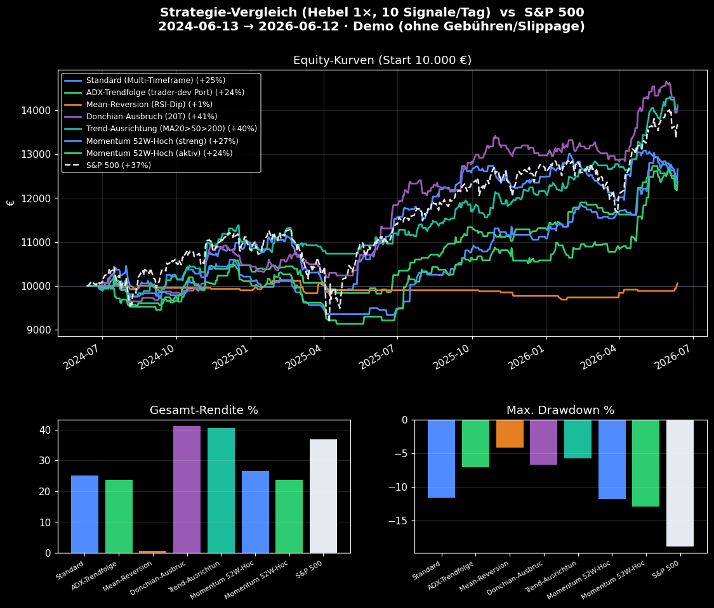
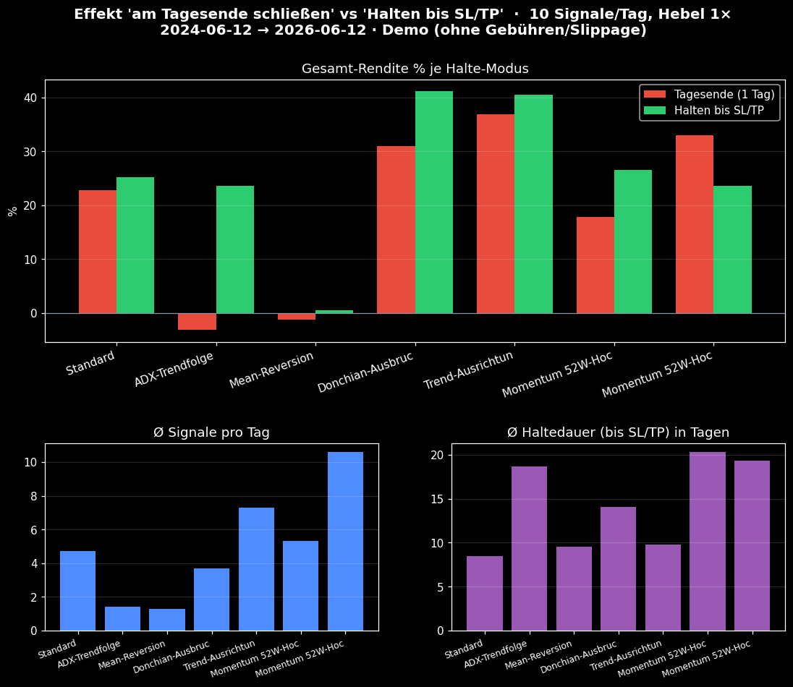

# 📊 Strategie-Report (alle Strategien) — Tiefenanalyse

*Erstellt: 2026-06-14 · Korb: S&P 500 (38 Aktien) · Zeitraum: 2024-06-12 → 2026-06-12 · 2 Jahre · Tages-Timeframe · Portfolio: 10 Signale/Tag, Hebel 1×, Start 10000€*

> **Demo-Backtest** — long-only, ATR-SL/TP, ohne Gebühren/Slippage. Alle Kennzahlen basieren auf einer täglichen Mark-to-Market-Equity-Kurve der Portfolio-Simulation.

## 📐 Methodik — wie Strategien verglichen werden

Verglichen wird wie bei professionellen Backtests **risiko-adjustiert**, nicht nur nach roher Rendite. Grundlage ist eine **tägliche Mark-to-Market-Equity-Kurve** (offene Positionen werden täglich zum Schlusskurs neu bewertet), aus der die Standard-Kennzahlen abgeleitet werden:

- **CAGR** — annualisierte Wachstumsrate (vergleichbar über verschieden lange Zeiträume).
- **Volatilität** — annualisierte Schwankung der Tagesrenditen (Risikomaß).
- **Max-Drawdown (+ Dauer)** — größter Rückgang vom Hoch und wie lange er anhielt.
- **Sharpe** = Überrendite / Volatilität (Rendite je Risikoeinheit; > 1 gut, > 2 sehr gut).
- **Sortino** = wie Sharpe, aber nur **Downside**-Volatilität (bestraft nur Verluste).
- **Calmar** = CAGR / Max-Drawdown (Rendite je Drawdown-Risiko).
- **Recovery-Factor** = Gesamtrendite / Max-Drawdown.
- **Beta / Alpha / Korrelation** gegenüber dem **S&P 500** (Markt­abhängigkeit & Mehrwert).
- **Trade-Qualität**: Profitfaktor, Trefferquote, **Payoff** (Ø Gewinn/Ø Verlust), Erwartungswert, **Kelly**, längste Gewinn-/Verlustserie, **Exposure** (Zeit im Markt).
- **t-Statistik** der mittleren Trade-Rendite: ist die Edge statistisch belastbar (Faustregel |t| > 2) oder Zufall?

## 🏆 Rangliste (nach Sharpe-Ratio)

| # | Strategie | CAGR % | Sharpe | Sortino | Calmar | Max DD % | Vol % | PF | Win % | Trades |
|---|-----------|------:|------:|------:|------:|--------:|-----:|----|------:|------:|
| 1 | Donchian-Ausbruch (20T) (`breakout`) | +18.9 | 1.49 | 2.33 | 2.15 | 8.8 | 12.1 | 1.48 | 42.7 | 302 |
| 2 | Trend-Ausrichtung (MA20>50>200) (`ma_trend`) | +18.6 | 1.48 | 2.24 | 2.82 | 6.6 | 12.1 | 1.47 | 42.4 | 403 |
| 3 | ADX-Trendfolge (trader-dev Port) (`adx_trend`) | +11.3 | 1.05 | 1.58 | 1.05 | 10.8 | 10.7 | 1.50 | 51.5 | 169 |
| 4 | Momentum 52W-Hoch (streng) (`high52`) | +12.6 | 1.05 | 1.59 | 1.07 | 11.8 | 11.9 | 1.45 | 45.6 | 193 |
| 5 | Standard (Multi-Timeframe) (`standard`) | +12.0 | 0.99 | 1.51 | 0.94 | 12.8 | 12.2 | 1.22 | 43.4 | 505 |
| 6 | Momentum 52W-Hoch (aktiv) (`high52_wide`) | +11.3 | 0.83 | 1.22 | 0.84 | 13.4 | 14.1 | 1.33 | 45.0 | 229 |
| 7 | Mean-Reversion (RSI-Dip) (`rsi_revert`) | +0.3 | 0.11 | 0.15 | 0.07 | 4.2 | 3.1 | 1.06 | 39.5 | 38 |
| **S&P 500 (Buy & Hold)** | +17.2 | 1.04 | 1.52 | 0.91 | 18.9 | 16.5 | — | — | — |

## 📈 Grafiken

## 🔍 Strategien im Detail

### Donchian-Ausbruch (20T)  (`breakout`)

Kauft den Ausbruch über das 20-Tage-Hoch (Trendfilter >MA50, Volumen). Weite ATR-SL/TP.

**Rendite & Risiko (Equity-Kurve)**

| Kennzahl | Wert |
|----------|-----:|
| Gesamt-Rendite | +41.1 % |
| CAGR (annualisiert) | +18.9 % |
| Volatilität (annualisiert) | 12.1 % |
| Max. Drawdown | 8.8 % |
| Max. Drawdown-Dauer | 115 Handelstage |

**Risiko-adjustiert & vs. S&P 500**

| Kennzahl | Wert |
|----------|-----:|
| Sharpe-Ratio | 1.49 |
| Sortino-Ratio | 2.33 |
| Calmar-Ratio | 2.15 |
| Recovery-Factor | 4.67 |
| Beta (vs. S&P 500) | 0.42 |
| Alpha annualisiert | +10.8 % |
| Korrelation (vs. S&P 500) | 0.58 |

**Trade-Qualität**

| Kennzahl | Wert |
|----------|-----:|
| Profitfaktor | 1.48 |
| Trefferquote (Win) | 42.7 % (129/302) |
| Verlustquote (Lose) | 57.3 % (173/302) |
| Payoff-Ratio (Ø Gewinn/Ø Verlust) | 1.98 |
| Ø Gewinn / Ø Verlust | +98.96€ / -50.00€ |
| Erwartungswert/Trade | +13.63€ (+1.36 %) |
| Bester / schlechtester Trade | +22.9 % / -12.6 % |
| Längste Serie Gewinne / Verluste | 8 / 16 |
| Kelly-Anteil | 13.8 % |
| t-Statistik der Edge | 2.90  ✅ signifikant |

**Aktivität**

| Kennzahl | Wert |
|----------|-----:|
| Trades gesamt / pro Jahr | 302 / 151.1 |
| Ø Haltedauer | 14.1 Tage |
| Exposure (Zeit im Markt) | 98.0 % |
| Ø gleichzeitige Positionen | 8.46 |
| Ø Signale/Tag | 3.7 (Median 3, Max 25) |

### Trend-Ausrichtung (MA20>50>200)  (`ma_trend`)

Kauft nur bei voll gestapeltem Aufwärtstrend (Kurs>MA20>MA50>MA200) + bullishem MACD.

**Rendite & Risiko (Equity-Kurve)**

| Kennzahl | Wert |
|----------|-----:|
| Gesamt-Rendite | +40.5 % |
| CAGR (annualisiert) | +18.6 % |
| Volatilität (annualisiert) | 12.1 % |
| Max. Drawdown | 6.6 % |
| Max. Drawdown-Dauer | 114 Handelstage |

**Risiko-adjustiert & vs. S&P 500**

| Kennzahl | Wert |
|----------|-----:|
| Sharpe-Ratio | 1.48 |
| Sortino-Ratio | 2.24 |
| Calmar-Ratio | 2.82 |
| Recovery-Factor | 6.13 |
| Beta (vs. S&P 500) | 0.39 |
| Alpha annualisiert | +11.1 % |
| Korrelation (vs. S&P 500) | 0.54 |

**Trade-Qualität**

| Kennzahl | Wert |
|----------|-----:|
| Profitfaktor | 1.47 |
| Trefferquote (Win) | 42.4 % (171/403) |
| Verlustquote (Lose) | 57.6 % (232/403) |
| Payoff-Ratio (Ø Gewinn/Ø Verlust) | 2.00 |
| Ø Gewinn / Ø Verlust | +73.62€ / -36.81€ |
| Erwartungswert/Trade | +10.05€ (+1.00 %) |
| Bester / schlechtester Trade | +16.6 % / -10.5 % |
| Längste Serie Gewinne / Verluste | 8 / 12 |
| Kelly-Anteil | 13.6 % |
| t-Statistik der Edge | 3.41  ✅ signifikant |

**Aktivität**

| Kennzahl | Wert |
|----------|-----:|
| Trades gesamt / pro Jahr | 403 / 201.6 |
| Ø Haltedauer | 9.8 Tage |
| Exposure (Zeit im Markt) | 96.8 % |
| Ø gleichzeitige Positionen | 7.85 |
| Ø Signale/Tag | 7.3 (Median 7, Max 20) |

### ADX-Trendfolge (trader-dev Port)  (`adx_trend`)

Trendfolge: Kurs>EMA200 + ADX(14)-Trend + Volatilitäts-Expansion & Velocity. ATR-SL/TP.

**Rendite & Risiko (Equity-Kurve)**

| Kennzahl | Wert |
|----------|-----:|
| Gesamt-Rendite | +23.6 % |
| CAGR (annualisiert) | +11.3 % |
| Volatilität (annualisiert) | 10.7 % |
| Max. Drawdown | 10.8 % |
| Max. Drawdown-Dauer | 160 Handelstage |

**Risiko-adjustiert & vs. S&P 500**

| Kennzahl | Wert |
|----------|-----:|
| Sharpe-Ratio | 1.05 |
| Sortino-Ratio | 1.58 |
| Calmar-Ratio | 1.05 |
| Recovery-Factor | 2.19 |
| Beta (vs. S&P 500) | 0.34 |
| Alpha annualisiert | +5.4 % |
| Korrelation (vs. S&P 500) | 0.53 |

**Trade-Qualität**

| Kennzahl | Wert |
|----------|-----:|
| Profitfaktor | 1.50 |
| Trefferquote (Win) | 51.5 % (87/169) |
| Verlustquote (Lose) | 48.5 % (82/169) |
| Payoff-Ratio (Ø Gewinn/Ø Verlust) | 1.42 |
| Ø Gewinn / Ø Verlust | +81.33€ / -57.46€ |
| Erwartungswert/Trade | +13.99€ (+1.40 %) |
| Bester / schlechtester Trade | +20.9 % / -17.5 % |
| Längste Serie Gewinne / Verluste | 8 / 7 |
| Kelly-Anteil | 17.2 % |
| t-Statistik der Edge | 2.35  ✅ signifikant |

**Aktivität**

| Kennzahl | Wert |
|----------|-----:|
| Trades gesamt / pro Jahr | 169 / 84.6 |
| Ø Haltedauer | 18.7 Tage |
| Exposure (Zeit im Markt) | 94.4 % |
| Ø gleichzeitige Positionen | 6.29 |
| Ø Signale/Tag | 1.4 (Median 1, Max 4) |

### Momentum 52W-Hoch (streng)  (`high52`)

Kauft Stärke nahe dem 52-Wochen-Hoch (≥98 %) im Aufwärtstrend (>MA50). Weite ATR-SL/TP. Im Backtest robust besser als die übrigen.

**Rendite & Risiko (Equity-Kurve)**

| Kennzahl | Wert |
|----------|-----:|
| Gesamt-Rendite | +26.6 % |
| CAGR (annualisiert) | +12.6 % |
| Volatilität (annualisiert) | 11.9 % |
| Max. Drawdown | 11.8 % |
| Max. Drawdown-Dauer | 189 Handelstage |

**Risiko-adjustiert & vs. S&P 500**

| Kennzahl | Wert |
|----------|-----:|
| Sharpe-Ratio | 1.05 |
| Sortino-Ratio | 1.59 |
| Calmar-Ratio | 1.07 |
| Recovery-Factor | 2.26 |
| Beta (vs. S&P 500) | 0.39 |
| Alpha annualisiert | +5.9 % |
| Korrelation (vs. S&P 500) | 0.53 |

**Trade-Qualität**

| Kennzahl | Wert |
|----------|-----:|
| Profitfaktor | 1.45 |
| Trefferquote (Win) | 45.6 % (88/193) |
| Verlustquote (Lose) | 54.4 % (105/193) |
| Payoff-Ratio (Ø Gewinn/Ø Verlust) | 1.73 |
| Ø Gewinn / Ø Verlust | +97.00€ / -56.01€ |
| Erwartungswert/Trade | +13.76€ (+1.38 %) |
| Bester / schlechtester Trade | +26.1 % / -12.8 % |
| Längste Serie Gewinne / Verluste | 6 / 17 |
| Kelly-Anteil | 14.2 % |
| t-Statistik der Edge | 2.24  ✅ signifikant |

**Aktivität**

| Kennzahl | Wert |
|----------|-----:|
| Trades gesamt / pro Jahr | 193 / 96.6 |
| Ø Haltedauer | 20.3 Tage |
| Exposure (Zeit im Markt) | 93.4 % |
| Ø gleichzeitige Positionen | 7.81 |
| Ø Signale/Tag | 5.3 (Median 5, Max 14) |

### Standard (Multi-Timeframe)  (`standard`)

Multi-Timeframe-Momentum: RSI/MACD/Trend/Volumen über 5m–1d, Stärke 0–100, ATR-SL/TP.

**Rendite & Risiko (Equity-Kurve)**

| Kennzahl | Wert |
|----------|-----:|
| Gesamt-Rendite | +25.2 % |
| CAGR (annualisiert) | +12.0 % |
| Volatilität (annualisiert) | 12.2 % |
| Max. Drawdown | 12.8 % |
| Max. Drawdown-Dauer | 94 Handelstage |

**Risiko-adjustiert & vs. S&P 500**

| Kennzahl | Wert |
|----------|-----:|
| Sharpe-Ratio | 0.99 |
| Sortino-Ratio | 1.51 |
| Calmar-Ratio | 0.94 |
| Recovery-Factor | 1.98 |
| Beta (vs. S&P 500) | 0.45 |
| Alpha annualisiert | +4.3 % |
| Korrelation (vs. S&P 500) | 0.61 |

**Trade-Qualität**

| Kennzahl | Wert |
|----------|-----:|
| Profitfaktor | 1.22 |
| Trefferquote (Win) | 43.4 % (219/505) |
| Verlustquote (Lose) | 56.6 % (286/505) |
| Payoff-Ratio (Ø Gewinn/Ø Verlust) | 1.60 |
| Ø Gewinn / Ø Verlust | +62.93€ / -39.37€ |
| Erwartungswert/Trade | +4.99€ (+0.50 %) |
| Bester / schlechtester Trade | +18.4 % / -8.9 % |
| Längste Serie Gewinne / Verluste | 10 / 17 |
| Kelly-Anteil | 7.9 % |
| t-Statistik der Edge | 2.06  ✅ signifikant |

**Aktivität**

| Kennzahl | Wert |
|----------|-----:|
| Trades gesamt / pro Jahr | 505 / 252.7 |
| Ø Haltedauer | 8.4 Tage |
| Exposure (Zeit im Markt) | 97.2 % |
| Ø gleichzeitige Positionen | 8.48 |
| Ø Signale/Tag | 4.7 (Median 4, Max 17) |

### Momentum 52W-Hoch (aktiv)  (`high52_wide`)

Wie streng, aber schon ab ≥95 % des 52-Wochen-Hochs → mehr Signale, höhere Gesamtrendite.

**Rendite & Risiko (Equity-Kurve)**

| Kennzahl | Wert |
|----------|-----:|
| Gesamt-Rendite | +23.6 % |
| CAGR (annualisiert) | +11.3 % |
| Volatilität (annualisiert) | 14.1 % |
| Max. Drawdown | 13.4 % |
| Max. Drawdown-Dauer | 118 Handelstage |

**Risiko-adjustiert & vs. S&P 500**

| Kennzahl | Wert |
|----------|-----:|
| Sharpe-Ratio | 0.83 |
| Sortino-Ratio | 1.22 |
| Calmar-Ratio | 0.84 |
| Recovery-Factor | 1.77 |
| Beta (vs. S&P 500) | 0.51 |
| Alpha annualisiert | +2.9 % |
| Korrelation (vs. S&P 500) | 0.60 |

**Trade-Qualität**

| Kennzahl | Wert |
|----------|-----:|
| Profitfaktor | 1.33 |
| Trefferquote (Win) | 45.0 % (103/229) |
| Verlustquote (Lose) | 55.0 % (126/229) |
| Payoff-Ratio (Ø Gewinn/Ø Verlust) | 1.62 |
| Ø Gewinn / Ø Verlust | +93.22€ / -57.45€ |
| Erwartungswert/Trade | +10.32€ (+1.03 %) |
| Bester / schlechtester Trade | +26.7 % / -17.5 % |
| Längste Serie Gewinne / Verluste | 10 / 17 |
| Kelly-Anteil | 11.1 % |
| t-Statistik der Edge | 1.83  ⚠️ schwach |

**Aktivität**

| Kennzahl | Wert |
|----------|-----:|
| Trades gesamt / pro Jahr | 229 / 114.6 |
| Ø Haltedauer | 19.4 Tage |
| Exposure (Zeit im Markt) | 97.4 % |
| Ø gleichzeitige Positionen | 8.84 |
| Ø Signale/Tag | 10.6 (Median 11, Max 22) |

### Mean-Reversion (RSI-Dip)  (`rsi_revert`)

Kauft Rücksetzer: RSI(14)<30 im langfristigen Aufwärtstrend (Kurs>MA200). ATR-SL/TP.

**Rendite & Risiko (Equity-Kurve)**

| Kennzahl | Wert |
|----------|-----:|
| Gesamt-Rendite | +0.6 % |
| CAGR (annualisiert) | +0.3 % |
| Volatilität (annualisiert) | 3.1 % |
| Max. Drawdown | 4.2 % |
| Max. Drawdown-Dauer | 326 Handelstage |

**Risiko-adjustiert & vs. S&P 500**

| Kennzahl | Wert |
|----------|-----:|
| Sharpe-Ratio | 0.11 |
| Sortino-Ratio | 0.15 |
| Calmar-Ratio | 0.07 |
| Recovery-Factor | 0.14 |
| Beta (vs. S&P 500) | 0.10 |
| Alpha annualisiert | -1.3 % |
| Korrelation (vs. S&P 500) | 0.50 |

**Trade-Qualität**

| Kennzahl | Wert |
|----------|-----:|
| Profitfaktor | 1.06 |
| Trefferquote (Win) | 39.5 % (15/38) |
| Verlustquote (Lose) | 60.5 % (23/38) |
| Payoff-Ratio (Ø Gewinn/Ø Verlust) | 1.62 |
| Ø Gewinn / Ø Verlust | +69.16€ / -42.61€ |
| Erwartungswert/Trade | +1.51€ (+0.15 %) |
| Bester / schlechtester Trade | +10.5 % / -9.7 % |
| Längste Serie Gewinne / Verluste | 3 / 6 |
| Kelly-Anteil | 2.2 % |
| t-Statistik der Edge | 0.16  ⚠️ schwach |

**Aktivität**

| Kennzahl | Wert |
|----------|-----:|
| Trades gesamt / pro Jahr | 38 / 19.0 |
| Ø Haltedauer | 9.6 Tage |
| Exposure (Zeit im Markt) | 43.8 % |
| Ø gleichzeitige Positionen | 0.73 |
| Ø Signale/Tag | 1.3 (Median 1, Max 3) |

